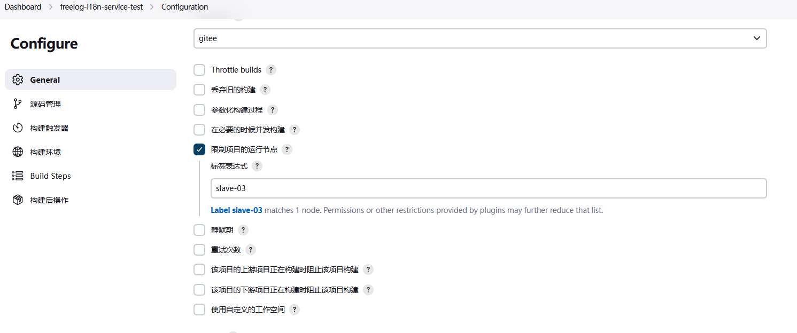

##CICD使用说明

### 1. 登录到jenkins控制台http://jenkins.testfreelog.com/

### 2. 配置任务项

####	2.1 新建任务

​	

####	2.2 构建一个自由风格的软件

​	

####	2.3 配置项目

#####	- 1 节点设置

```
jenkins运行在k8s容器中，而容器的环境有限，如果我们的项目运行所需要的环境复杂，就可以将计算机实例作为节点，让项目在该计算机上运行；例如，我们可以将该项目运行在slave-03节点上；
```

​	

```
在 系统配置 >> 节点管理 中，可以看到我们已经配置的节点；master是jenkins所在的环境，可能直接运行在计算机实例上，也可能像我们一样运行在容器中；
slave-03就是我们新添加的节点，运行在我们的3号机实例上；
```

​	

```
远程工作目录：即节点的工作空间，节点所在的计算机实例中的指定文件夹；
配置节点所在的计算机实例ip地址，证书（也可以使用其他方式做验证）；
```

​	

​	

​	

```
需要注意的是，在jenkins连接节点之前，要保证节点所在的计算机实例是有jdk环境的（jenkins是java开发的）；
另外，在节点上运行项目，意味着项目直接运行在节点所在的计算机实例中，所以实例需要有项目所要的运行环境，比如说git工具；

yum install -y java-11-openjdk-devel.x86_64
yum install -y git
```

​	
#####	- 2 源码管理

```
Git地址 就是我们pull时的地址，同git remote add [name] [url]中的url地址；
下面的源码库管理器中的 URL 是项目所在的地址；
```

​	


<font color='red'>现在我们先保存构建一次看看效果（我们选择在刚新建的slave-02节点上执行）</font>

​	

​	

#####	- 3 构建触发器

```
在jenkins中配置Github的触发器很简单，只需要勾选 GitHub hook trigger for GITScm polling 即可；
在Github项目中配置钩子，填写我们jenkins的回调地址；
```

​	

​	

#####	- 4 构建步骤

```
在pull代码之后，执行自定义的构建步骤，例如编译；
我们在这里要做的是打包项目镜像，所以创建了如下的shell命令；
```

​	

<font color='red'>构建结果如下，分别是jenkins构建日志，容器构建镜像，阿里云容器镜像更新日志</font>

​	
​	
​	

### 3. 补充